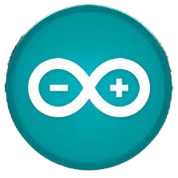

    
    
  <h3 align="center">Integrasi Saweria dengan ESP32</h3>

# Langkah-Langkah untuk Mengakses API

## Mengakses API Saweria secara Tidak Langsung
Saweria memungkinkan pengunjung untuk memberikan donasi melalui laman akun kreator dengan:

### 1. Membuka Halaman Profil Kreator
Masuk ke <a href="https://saweria.co/sirbutt"> halaman donasi </a>.

Di halaman ini, terdapat antarmuka seperti berikut:

- Pilihan untuk jumlah donasi.
- Input untuk nama donatur.
- Input untuk email donatur.
- Input untuk pesan.
- Opsi metode pembayaran (hanya melayani metode pembayaran lokal).

### 2. Memasukkan Data Donasi
- Jumlah Donasi: Pilih atau ketik nominal donasi yang ingin diberikan (dalam rupiah).
- Nama Donatur: Masukkan nama Anda.
- Email Donatur: Masukkan email Anda.
- Pesan Donasi: Tambahkan pesan khusus.

### 3. Memilih Metode Pembayaran
Pilih metode pembayaran yang tersedia, seperti:

- QRIS
- GoPay
- OVO
- Dana
- LinkAja!

### 4. Mengonfirmasi Donasi
Klik tombol "Kirim Dukungan". 
Anda akan diarahkan ke halaman pembayaran untuk menyelesaikan transaksi.

## Cara Kerja di Background
Ketika pengguna mengirim donasi, Saweria akan memproses notifikasi berisi data donasi (nama, jumlah, pesan, metode pembayaran) melalui webhook url.

Notifikasi yang masuk ini nanti akan menjadi notifikasi bagi logika ESP32-CAM.

## Mengapa Tidak Mengakses API Secara Langsung?
Setiap akun Saweria memiliki STREAM-KEY nya masing-masing yang unik dan dapat diatur.

STREAM-KEY inilah yang membantu verifikasi data yang masuk ke webhook dengan menghasilkan signature dengan algoritma HMAC-SHA256.

Webhook ditangani menggunakan FastAPI yang juga mempunyai STREAM-KEY yang sama berdasarkan webhook kreator yang ditangani. Oleh karena itu, pengaksesan API secara langsung tidak memungkinkan bagi orang lain karena STREAM-KEY tidak diketahui.
